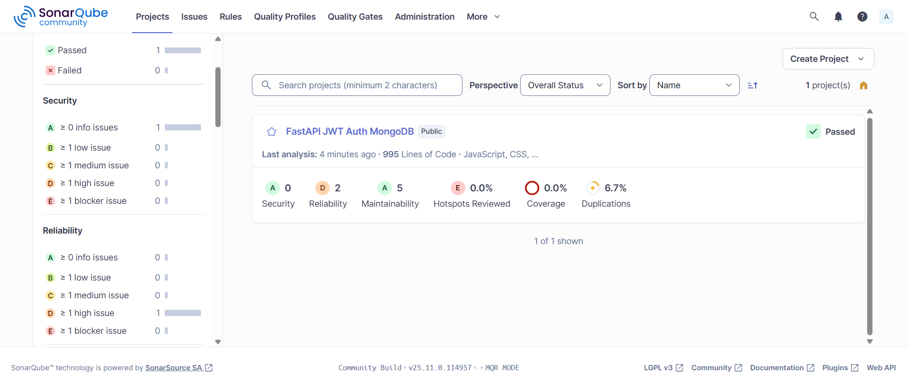

# 🚀 SonarQube Quality Test - FastAPI JWT Auth MongoDB

Projet de test complet pour analyser la qualité du code avec SonarQube. Ce projet inclut une application web full-stack (FastAPI + React) avec authentification JWT et MongoDB, ainsi qu'une configuration SonarQube pour l'analyse de qualité de code.

## 📋 Table des matières

- [Vue d'ensemble](#vue-densemble)
- [Architecture](#architecture)
- [Technologies utilisées](#technologies-utilisées)
- [Structure du projet](#structure-du-projet)
- [Installation](#installation)
- [Utilisation](#utilisation)
- [Analyse SonarQube](#analyse-sonarqube)
- [Fonctionnement de l'application](#fonctionnement-de-lapplication)
- [API Documentation](#api-documentation)

---

## 🎯 Vue d'ensemble

Ce projet est une application web complète de démonstration qui combine :

- **Backend** : API REST avec FastAPI, authentification JWT, et base de données MongoDB
- **Frontend** : Interface utilisateur moderne avec React et Vite
- **Qualité de code** : Configuration SonarQube pour l'analyse statique du code
- **Containerisation** : Docker Compose pour un déploiement facile

### Fonctionnalités principales

✅ Authentification utilisateur (Inscription/Connexion)  
✅ Gestion des tokens JWT  
✅ Interface utilisateur moderne et responsive  
✅ Analyse de qualité de code avec SonarQube  
✅ Architecture microservices avec Docker  

---

## 🏗️ Architecture

### Diagramme d'architecture globale

```
┌─────────────────────────────────────────────────────────────┐
│                        CLIENT NAVIGATEUR                       │
│                      (React + Vite)                            │
│                    http://localhost:5173                       │
└────────────────────────────┬──────────────────────────────────┘
                             │
                             │ HTTP Requests
                             │ (Axios)
                             ▼
┌─────────────────────────────────────────────────────────────┐
│                      FRONTEND CONTAINER                       │
│  ┌────────────────────────────────────────────────────────┐  │
│  │  React Application (Port 5173)                         │  │
│  │  - Pages: Login, Register, Home                        │  │
│  │  - Components: Navbar                                  │  │
│  │  - API Client: Axios                                   │  │
│  └────────────────────────────────────────────────────────┘  │
└────────────────────────────┬──────────────────────────────────┘
                             │
                             │ REST API
                             │ (JSON)
                             ▼
┌─────────────────────────────────────────────────────────────┐
│                      BACKEND CONTAINER                        │
│  ┌────────────────────────────────────────────────────────┐  │
│  │  FastAPI Application (Port 8000)                       │  │
│  │  ┌──────────────────────────────────────────────────┐  │  │
│  │  │  Auth Router (/auth)                             │  │  │
│  │  │  - POST /register                                │  │  │
│  │  │  - POST /login                                   │  │  │
│  │  └──────────────────────────────────────────────────┘  │  │
│  │  ┌──────────────────────────────────────────────────┐  │  │
│  │  │  Auth Utils                                      │  │  │
│  │  │  - hash_password()                               │  │  │
│  │  │  - verify_password()                             │  │  │
│  │  │  - create_access_token()                         │  │  │
│  │  └──────────────────────────────────────────────────┘  │  │
│  └────────────────────────────────────────────────────────┘  │
└────────────────────────────┬──────────────────────────────────┘
                             │
                             │ MongoDB Driver (Motor)
                             │
                             ▼
┌─────────────────────────────────────────────────────────────┐
│                      MONGODB CONTAINER                       │
│  ┌────────────────────────────────────────────────────────┐  │
│  │  MongoDB Database (Port 27017)                         │  │
│  │  - Database: fastapi_auth                              │  │
│  │  - Collection: users                                   │  │
│  │    {                                                    │  │
│  │      "_id": ObjectId,                                  │  │
│  │      "username": string,                               │  │
│  │      "email": string,                                  │  │
│  │      "password": string (bcrypt hashed)               │  │
│  │    }                                                   │  │
│  └────────────────────────────────────────────────────────┘  │
└─────────────────────────────────────────────────────────────┘

┌─────────────────────────────────────────────────────────────┐
│                    SONARQUBE CONTAINER                       │
│  ┌────────────────────────────────────────────────────────┐  │
│  │  SonarQube Server (Port 9000)                          │  │
│  │  - Code Quality Analysis                               │  │
│  │  - Security Scanning                                   │  │
│  │  - Code Coverage                                       │  │
│  │  - Duplication Detection                               │  │
│  └────────────────────────────────────────────────────────┘  │
└─────────────────────────────────────────────────────────────┘
```

### Flux d'authentification

```
┌──────────┐                    ┌──────────┐                    ┌──────────┐
│  Client  │                    │ Backend  │                    │ MongoDB  │
└────┬─────┘                    └────┬─────┘                    └────┬─────┘
     │                               │                               │
     │  1. POST /auth/register       │                               │
     │  {username, email, password}   │                               │
     │───────────────────────────────>│                               │
     │                               │                               │
     │                               │  2. Vérifier email existant   │
     │                               │───────────────────────────────>│
     │                               │                               │
     │                               │  3. Hash password (bcrypt)    │
     │                               │                               │
     │                               │  4. Insérer utilisateur       │
     │                               │───────────────────────────────>│
     │                               │                               │
     │  5. {msg: "Utilisateur créé"} │                               │
     │<──────────────────────────────│                               │
     │                               │                               │
     │  6. POST /auth/login          │                               │
     │  {email, password}             │                               │
     │───────────────────────────────>│                               │
     │                               │                               │
     │                               │  7. Rechercher utilisateur     │
     │                               │───────────────────────────────>│
     │                               │                               │
     │                               │  8. Vérifier password          │
     │                               │  (bcrypt.verify)              │
     │                               │                               │
     │                               │  9. Générer JWT token          │
     │                               │  (HS256, 30 min)              │
     │                               │                               │
     │  10. {access_token: "..."}    │                               │
     │<──────────────────────────────│                               │
     │                               │                               │
     │  11. Stocker token (localStorage)                              │
     │                               │                               │
```

### Diagramme de classes (Backend)

```
┌─────────────────────────────────────────────────────────────┐
│                        FastAPI App                           │
│  ┌────────────────────────────────────────────────────────┐ │
│  │  - app: FastAPI                                         │ │
│  │  - CORS Middleware                                      │ │
│  │  - include_router(auth_router)                          │ │
│  └────────────────────────────────────────────────────────┘ │
└────────────────────────────┬──────────────────────────────────┘
                             │
                             │ uses
                             ▼
┌─────────────────────────────────────────────────────────────┐
│                    Auth Router                              │
│  ┌────────────────────────────────────────────────────────┐ │
│  │  Routes:                                               │ │
│  │  - POST /auth/register                                 │ │
│  │  - POST /auth/login                                    │ │
│  │  - GET /auth/                                          │ │
│  └────────────────────────────────────────────────────────┘ │
└────────────┬───────────────────────────┬──────────────────────┘
             │                           │
             │ uses                      │ uses
             ▼                           ▼
┌──────────────────────────┐  ┌──────────────────────────────┐
│   Pydantic Models        │  │   Auth Utils                 │
│  ┌────────────────────┐  │  │  ┌────────────────────────┐ │
│  │ UserRegister       │  │  │  │ hash_password()        │ │
│  │ - username: str    │  │  │  │ verify_password()      │ │
│  │ - email: EmailStr  │  │  │  │ create_access_token()  │ │
│  │ - password: str    │  │  │  └────────────────────────┘ │
│  └────────────────────┘  │  └──────────────────────────────┘
│  ┌────────────────────┐  │
│  │ UserLogin          │  │
│  │ - email: EmailStr  │  │
│  │ - password: str    │  │
│  └────────────────────┘  │
└──────────────────────────┘
             │
             │ uses
             ▼
┌─────────────────────────────────────────────────────────────┐
│                    Database Layer                           │
│  ┌────────────────────────────────────────────────────────┐ │
│  │  - AsyncIOMotorClient                                  │ │
│  │  - db: "fastapi_auth"                                  │ │
│  │  - users_collection                                    │ │
│  └────────────────────────────────────────────────────────┘ │
└────────────────────────────┬──────────────────────────────────┘
                             │
                             │ connects to
                             ▼
┌─────────────────────────────────────────────────────────────┐
│                      MongoDB                                │
│  ┌────────────────────────────────────────────────────────┐ │
│  │  Database: fastapi_auth                                │ │
│  │  Collection: users                                     │ │
│  └────────────────────────────────────────────────────────┘ │
└─────────────────────────────────────────────────────────────┘
```

---

## 🛠️ Technologies utilisées

### Backend
- **FastAPI** 0.115.2 - Framework web moderne et rapide pour Python
- **Motor** 3.6.0 - Driver asynchrone MongoDB pour Python
- **Python-JOSE** 3.3.0 - Implémentation JWT
- **Passlib** 1.7.4 - Hachage de mots de passe (bcrypt)
- **Pydantic** 2.9.2 - Validation de données
- **Uvicorn** 0.30.6 - Serveur ASGI

### Frontend
- **React** 19.1.1 - Bibliothèque UI
- **React Router DOM** 7.9.5 - Routage côté client
- **Axios** 1.13.2 - Client HTTP
- **Vite** 7.1.14 - Build tool et dev server

### Infrastructure
- **Docker** & **Docker Compose** - Containerisation
- **MongoDB** 7 - Base de données NoSQL
- **SonarQube** Community v25.11.0 - Analyse de qualité de code

---

## 📁 Structure du projet

```
sonar-quality-test/
│
├── docker-compose.yaml              # Configuration SonarQube
├── sonar-project.properties         # Configuration projet SonarQube
│
├── fastapi-jwt-auth-mongodb/        # Application principale
│   ├── backend/
│   │   ├── app/
│   │   │   ├── __init__.py
│   │   │   ├── main.py              # Point d'entrée FastAPI
│   │   │   ├── auth/
│   │   │   │   ├── __init__.py
│   │   │   │   ├── routes.py        # Routes d'authentification
│   │   │   │   └── utils.py         # Utilitaires JWT & password
│   │   │   └── models/
│   │   │       ├── __init__.py
│   │   │       ├── database.py      # Configuration MongoDB
│   │   │       └── model.py         # Modèles Pydantic
│   │   ├── Dockerfile
│   │   └── requirements.txt
│   │
│   ├── frontend/
│   │   ├── src/
│   │   │   ├── pages/
│   │   │   │   ├── Login.jsx        # Page de connexion
│   │   │   │   ├── Register.jsx     # Page d'inscription
│   │   │   │   └── Home.jsx         # Page d'accueil
│   │   │   ├── components/
│   │   │   │   └── Navbar.jsx       # Barre de navigation
│   │   │   ├── api/
│   │   │   │   └── axois.js         # Configuration Axios
│   │   │   ├── App.jsx              # Composant principal
│   │   │   └── main.jsx             # Point d'entrée React
│   │   ├── Dockerfile
│   │   ├── package.json
│   │   └── vite.config.js
│   │
│   ├── docker-compose.yml           # Configuration app (MongoDB + Backend + Frontend)
│   └── README.md
│
└── Images/
    └── PremierScan.png              # Capture d'écran SonarQube
```

---

## 🚀 Installation

### Prérequis

- Docker et Docker Compose installés
- Git (optionnel)

### Étapes d'installation

1. **Cloner le repository** (ou télécharger le projet)
   ```bash
   git clone <repository-url>
   cd sonar-quality-test
   ```

2. **Démarrer SonarQube**
   ```bash
   docker-compose up -d
   ```
   SonarQube sera accessible sur `http://localhost:9000`

3. **Configurer SonarQube** (première utilisation)
   - Accéder à `http://localhost:9000`
   - Connexion par défaut : `admin` / `admin`
   - Changer le mot de passe si demandé
   - Créer un token dans **My Account > Security > Generate Token**
   - Mettre à jour `sonar-project.properties` avec votre token

4. **Démarrer l'application**
   ```bash
   cd fastapi-jwt-auth-mongodb
   docker-compose up -d
   ```

5. **Vérifier que tout fonctionne**
   - Frontend : `http://localhost:5173`
   - Backend API : `http://localhost:8000`
   - API Docs : `http://localhost:8000/docs`
   - MongoDB : `localhost:27017`

---

## 💻 Utilisation

### Lancer l'application

1. **Démarrer tous les services**
   ```bash
   # Depuis la racine du projet
   docker-compose up -d                    # SonarQube
   cd fastapi-jwt-auth-mongodb
   docker-compose up -d                    # Application
   ```

2. **Accéder à l'application**
   - Ouvrir `http://localhost:5173` dans votre navigateur
   - S'inscrire avec un nouveau compte
   - Se connecter avec vos identifiants

### Arrêter l'application

```bash
# Arrêter l'application
cd fastapi-jwt-auth-mongodb
docker-compose down

# Arrêter SonarQube
cd ..
docker-compose down
```

---

## 📊 Analyse SonarQube

### Configuration SonarQube

Le projet est configuré pour l'analyse de qualité de code avec SonarQube. La configuration se trouve dans `sonar-project.properties`.

### Exécuter l'analyse

1. **Installer SonarScanner** (si pas déjà installé)
   ```bash
   # Windows (avec Chocolatey)
   choco install sonarscanner-msbuild-net46
   
   # Linux/Mac
   # Télécharger depuis https://docs.sonarqube.org/latest/analysis/scan/sonarscanner/
   ```

2. **Lancer l'analyse**
   ```bash
   # Depuis la racine du projet
   sonar-scanner
   ```

3. **Visualiser les résultats**
   - Accéder à `http://localhost:9000`
   - Naviguer vers **Projects** > **FastAPI JWT Auth MongoDB**

### Résultats de l'analyse



#### Métriques de qualité

D'après l'analyse SonarQube, le projet présente les métriques suivantes :

| Métrique | Grade | Valeur | Statut |
|----------|-------|--------|--------|
| **Security** | A | 0 issues | ✅ Excellent |
| **Reliability** | D | 2 issues | ⚠️ À améliorer |
| **Maintainability** | A | 5 issues | ✅ Bon |
| **Hotspots Reviewed** | E | 0.0% | ⚠️ À améliorer |
| **Coverage** | - | 0.0% | ⚠️ Tests manquants |
| **Duplications** | - | 6.7% | ✅ Acceptable |

#### Détails des métriques

- **Security (A)** : Aucune vulnérabilité de sécurité détectée. Le code utilise des pratiques sécurisées (hachage bcrypt, JWT).
- **Reliability (D)** : 2 problèmes de fiabilité détectés. Il est recommandé de les corriger pour améliorer la stabilité.
- **Maintainability (A)** : 5 problèmes de maintenabilité mineurs. Le code est globalement bien structuré.
- **Code Coverage (0.0%)** : Aucun test unitaire n'est présent. Il est fortement recommandé d'ajouter des tests.
- **Duplications (6.7%)** : Taux de duplication acceptable, mais peut être optimisé.

#### Recommandations

1. ✅ **Sécurité** : Maintenir les bonnes pratiques actuelles
2. 🔧 **Fiabilité** : Corriger les 2 problèmes détectés
3. 📝 **Tests** : Ajouter des tests unitaires et d'intégration
4. 🔍 **Hotspots** : Réviser les hotspots de sécurité
5. 📊 **Couverture** : Viser au moins 70% de couverture de code

---

## ⚙️ Fonctionnement de l'application

### Architecture en couches

L'application suit une architecture en couches claire :

```
┌─────────────────────────────────────────┐
│         COUCHE PRÉSENTATION             │
│  (React Components & Pages)             │
└─────────────────┬───────────────────────┘
                  │
                  │ HTTP/JSON
                  ▼
┌─────────────────────────────────────────┐
│         COUCHE API                      │
│  (FastAPI Routes & Middleware)          │
└─────────────────┬───────────────────────┘
                  │
                  │ Business Logic
                  ▼
┌─────────────────────────────────────────┐
│         COUCHE SERVICE                  │
│  (Auth Utils: JWT, Password Hashing)    │
└─────────────────┬───────────────────────┘
                  │
                  │ Data Access
                  ▼
┌─────────────────────────────────────────┐
│         COUCHE DONNÉES                  │
│  (MongoDB via Motor Driver)              │
└─────────────────────────────────────────┘
```

### Flux de données détaillé

#### 1. Inscription (Register)

```
Client → Frontend (Register.jsx)
  ↓
  POST /auth/register
  {username, email, password}
  ↓
Backend (routes.py: register())
  ↓
  Vérification email existant (MongoDB)
  ↓
  Hash password (utils.py: hash_password())
  ↓
  Insertion utilisateur (MongoDB)
  ↓
  Réponse: {msg: "Utilisateur créé avec succès"}
  ↓
Frontend affiche message de succès
```

#### 2. Connexion (Login)

```
Client → Frontend (Login.jsx)
  ↓
  POST /auth/login
  {email, password}
  ↓
Backend (routes.py: login())
  ↓
  Recherche utilisateur (MongoDB)
  ↓
  Vérification password (utils.py: verify_password())
  ↓
  Génération JWT (utils.py: create_access_token())
  ↓
  Réponse: {access_token: "...", token_type: "bearer"}
  ↓
Frontend stocke token (localStorage)
  ↓
Redirection vers /home
```

#### 3. Sécurité

- **Mots de passe** : Hachés avec bcrypt (algorithme de hachage unidirectionnel)
- **JWT** : Tokens signés avec HS256, expiration de 30 minutes
- **CORS** : Configuré pour autoriser uniquement les origines frontend
- **Validation** : Pydantic valide tous les inputs utilisateur

### Composants Frontend

#### App.jsx
- Point d'entrée de l'application React
- Configure le routage avec React Router
- Inclut la Navbar sur toutes les pages

#### Pages
- **Login.jsx** : Formulaire de connexion avec gestion d'erreurs
- **Register.jsx** : Formulaire d'inscription avec validation
- **Home.jsx** : Page d'accueil après authentification

#### API Client (axois.js)
- Configuration Axios avec baseURL
- Headers CORS configurés
- Prêt pour l'ajout d'intercepteurs (tokens, erreurs)

---

## 📚 API Documentation

### Endpoints disponibles

#### `GET /`
Retourne un message de bienvenue.

**Réponse :**
```json
{
  "message": "API Auth FastAPI + MongoDB + JWT 👋"
}
```

#### `POST /auth/register`
Inscription d'un nouvel utilisateur.

**Body :**
```json
{
  "username": "john_doe",
  "email": "john@example.com",
  "password": "securePassword123"
}
```

**Réponse (succès) :**
```json
{
  "msg": "Utilisateur créé avec succès"
}
```

**Erreurs :**
- `400` : Email déjà utilisé

#### `POST /auth/login`
Connexion d'un utilisateur existant.

**Body :**
```json
{
  "email": "john@example.com",
  "password": "securePassword123"
}
```

**Réponse (succès) :**
```json
{
  "access_token": "eyJhbGciOiJIUzI1NiIsInR5cCI6IkpXVCJ9...",
  "token_type": "bearer"
}
```

**Erreurs :**
- `401` : Email ou mot de passe incorrect

### Documentation interactive

Accéder à la documentation Swagger automatique :
- **Swagger UI** : `http://localhost:8000/docs`
- **ReDoc** : `http://localhost:8000/redoc`

---

## 🔧 Configuration

### Variables d'environnement

#### Backend
Créer un fichier `.env` dans `fastapi-jwt-auth-mongodb/backend/` :

```env
MONGO_URI=mongodb://mongodb:27017/fastapi_auth
SECRET_KEY=your-secret-key-change-this-in-production-min-32-chars
ALGORITHM=HS256
```

#### Frontend
Créer un fichier `.env` dans `fastapi-jwt-auth-mongodb/frontend/` :

```env
VITE_API_URL=http://localhost:8000
```

#### SonarQube
Mettre à jour `sonar-project.properties` avec votre token :

```properties
sonar.login=your-sonarqube-token
```

---

## 🐛 Dépannage

### Problèmes courants

1. **Port déjà utilisé**
   - Vérifier que les ports 8000, 5173, 9000, 27017 sont libres
   - Modifier les ports dans `docker-compose.yml` si nécessaire

2. **Erreur de connexion MongoDB**
   - Vérifier que le container MongoDB est démarré : `docker ps`
   - Vérifier la variable `MONGO_URI` dans `.env`

3. **SonarQube ne démarre pas**
   - Vérifier les logs : `docker-compose logs sonarqube`
   - Sur Windows, désactiver les checks Elasticsearch : `SONAR_ES_BOOTSTRAP_CHECKS_DISABLE=true`

4. **Erreur CORS**
   - Vérifier que les origines dans `main.py` correspondent à votre URL frontend

---

## 📝 Licence

Ce projet est un projet de démonstration et d'apprentissage.

---

## 👥 Contribution

Les contributions sont les bienvenues ! N'hésitez pas à ouvrir une issue ou une pull request.

---

## 📞 Support

Pour toute question ou problème, veuillez ouvrir une issue sur le repository.

---

**Développé avec ❤️ pour l'analyse de qualité de code avec SonarQube**
